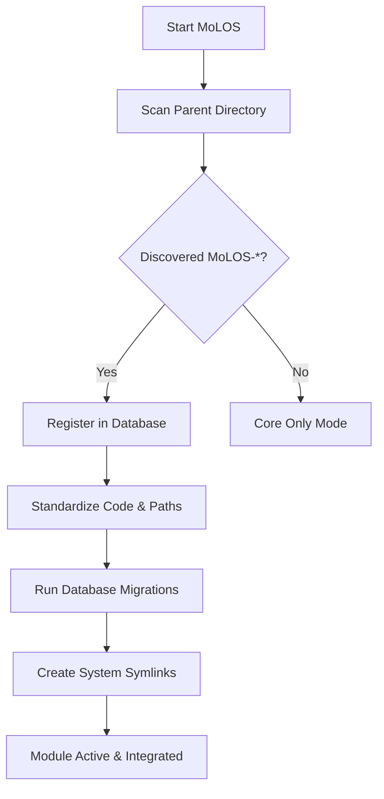

# 🌟 MoLOS: Modular Life Organization System

[](https://github.com/MoLOS-App/MoLOS/pkgs/container/molos)

### Your life isn't one-size-fits-all. Your organizer shouldn't be either.

MoLOS is a fast, privacy-focused, and deeply modular productivity suite designed to help you reclaim your focus. Built with a "local-first" philosophy and a modern tech stack, it bridges the gap between simple to-do lists and complex second-brain systems.

---

## ✨ Why MoLOS?

Most productivity apps are either too simple to be useful or too complex to maintain. MoLOS was born from a desire for something different:

- **🚀 Blazing Fast:** Built with SvelteKit for near-instant interactions.
- **🧩 Truly Modular:** Only use what you need. Tasks, Notes, and Routines are integrated but independent.
- **🔒 Privacy First:** You own your data. Self-host it on your own hardware and never worry about cloud lock-in.
- **📱 Cross-Platform:** A consistent experience across desktop and mobile.

---

## 🎯 Core Modules

### 📋 Tasks: Master Your Day

Stop wading through the noise. MoLOS uses a lightweight **Eisenhower Matrix** (Urgent/Important) to help you instantly spot the tasks that actually move the needle.

- **Smart Focus:** Priority levels and tags that make sense.
- **Recurring Logic:** Set it and forget it—daily, weekly, or custom routines.
- **Context Linking:** Connect tasks directly to notes or habits.

### 🧠 Knowledge: Your Digital Brain

A structured home for your thoughts, organized and instantly searchable.

- **Markdown Power:** Write sharp, structured content with a robust editor.
- **Hierarchical Folders:** Organize like a pro with nested structures and tags.
- **Lightning Search:** Find that one note from three months ago in milliseconds.

### 🏃 Routines: Build Momentum

Habits are the compound interest of self-improvement. Track them without the friction.

- **Flexible Tracking:** Simple yes/no habits or measurable inputs (water, pages, minutes).
- **Streak Protection:** Server-side calculations ensure your progress is always accurate.
- **Visual Progress:** Beautiful calendars and progress bars to keep you motivated.

---

## 🚀 Quick Start (Self-Hosting)

The fastest way to get MoLOS running is via Docker. We provide a pre-built image ready for deployment.

### 1. Pull the Image

```bash
docker pull ghcr.io/eduardez/molos:latest
```

### 2. Run with Docker Compose

Create a `docker-compose.yml` file:

```yaml
services:
  molos:
    image: ghcr.io/eduardez/molos:latest
    ports:
      - '4173:4173'
    volumes:
      - ./molos_data:/data
      - ./molos_data/external_modules:/app/external_modules
    environment:
      - DATABASE_URL=file:/data/molos.db
      - BETTER_AUTH_SECRET=<Just run "openssl rand -base64 32" to generate one>
      # Or mount a Docker secret and point to it:
      # - BETTER_AUTH_SECRET_FILE=/run/secrets/better_auth_secret
      # Add other env vars as needed
```

Then run:

```bash
docker compose up -d
```

---

## 🏗️ For Developers

MoLOS is built for extensibility. If you're a developer, you'll love the clean architecture.

### The Tech Stack

| Component        | Technology                               | Role                                                 |
| :--------------- | :--------------------------------------- | :--------------------------------------------------- |
| **Frontend/API** | [SvelteKit](https://kit.svelte.dev/)     | Full-stack framework for UI and REST/tRPC endpoints. |
| **Database**     | [SQLite](https://www.sqlite.org/)        | Lightweight, reliable, and easy to back up.          |
| **ORM**          | [Drizzle](https://orm.drizzle.team/)     | Type-safe database operations.                       |
| **Styling**      | [Tailwind CSS](https://tailwindcss.com/) | Utility-first styling for a clean, modern UI.        |

### Local Development

1.  **Clone:** `git clone https://github.com/MoLOS-App/MoLOS.git`
2.  **Install:** `npm install`
3.  **Dev:** `npm run dev`

---

## 🧩 Plug-and-Play Module System

MoLOS features a sophisticated, dynamic module management system that allows for seamless integration of optional features. This "Plug-and-Play" architecture ensures that the core application remains lightweight while providing a powerful ecosystem of optional modules.

### 🛠 How it Works

The system is designed to be "zero-config" for the end user. It automatically manages the lifecycle of external modules through a discovery and standardization process:



### 📋 Key Features

- **Automatic Discovery:** On startup, MoLOS scans its parent directory for any folders starting with `MoLOS-`. These are identified as potential modules and registered automatically.
- **Dynamic Linking:** Discovered modules are automatically symlinked into the core application. This includes their UI routes, API endpoints, and internal libraries, making them appear as native parts of the app.
- **Smart Standardization:** The system programmatically audits each module's code. It automatically fixes path discrepancies, standardizes configuration exports, and rewrites internal import aliases (e.g., `$lib/stores/...`) to ensure the module "just works" within the main app's structure.
- **Automated Database Management:** If a module requires its own database tables, the system automatically detects its Drizzle configuration and applies the necessary migrations or schema pushes during the synchronization phase.
- **Unified Development:** Developers can work on the entire ecosystem simultaneously using `npm run dev:all`, which orchestrates the core application and all active modules, keeping their databases in sync in real-time.

### 🔄 Module Lifecycle

1.  **Discovery:** The `ModuleManager` identifies local module folders in the workspace.
2.  **Validation:** Each module's `manifest.yaml` is checked for consistency.
3.  **Standardization:** The system rewrites internal imports and navigation links to match the core's routing structure.
4.  **Database Sync:** Drizzle migrations are executed to ensure the module's data layer is ready.
5.  **Linking:** Symlinks are created for `routes/ui`, `routes/api`, and `lib` folders.
6.  **Activation:** The module becomes available in the UI and API immediately.

This architecture allows MoLOS to remain lightweight while offering a vast library of optional, deeply integrated modules like Finance, Health, and Task management.

### 🛠 Managing Modules

MoLOS provides commands to manage external modules:

#### Auto-Discovery and Synchronization

- **Auto-Discovery:** When `MOLOS_AUTOLOAD_MODULES=true` (default in development), MoLOS automatically scans the `external_modules` directory for folders starting with `MoLOS-` and registers them as local modules.
- **Sync Command:** `npm run modules:sync` - Synchronizes all modules, applying migrations, creating symlinks, and cleaning up broken links.

#### Adding a Module

1. Place the module folder (e.g., `MoLOS-Finance`) in the `external_modules` directory.
2. Run `npm run modules:sync` to register and integrate the module.
3. The module will be automatically linked into the core application.

#### Removing a Module

1. Remove the module folder from `external_modules`.
2. Run `npm run modules:sync` to clean up symlinks and database entries.
3. Alternatively, modules can be disabled/enabled through the UI settings.

#### Development Commands

- **Orchestrated Dev:** `npm run dev:all` - Starts the core application and all active modules simultaneously, keeping databases synchronized.
- **Standalone Module Dev:** For individual module development, use the module's own `npm run dev` in its directory.

---

## 🤝 Contributing

We love contributors! Whether you're fixing a bug, adding a module, or improving documentation, your help is welcome. Check out our [Development Guide](docs/guides/developing-new-modules/INDEX.md) to see how we build things.

---

_MoLOS is a passion project built to make life organization painless. If you find it useful, consider giving us a ⭐ on GitHub!_
