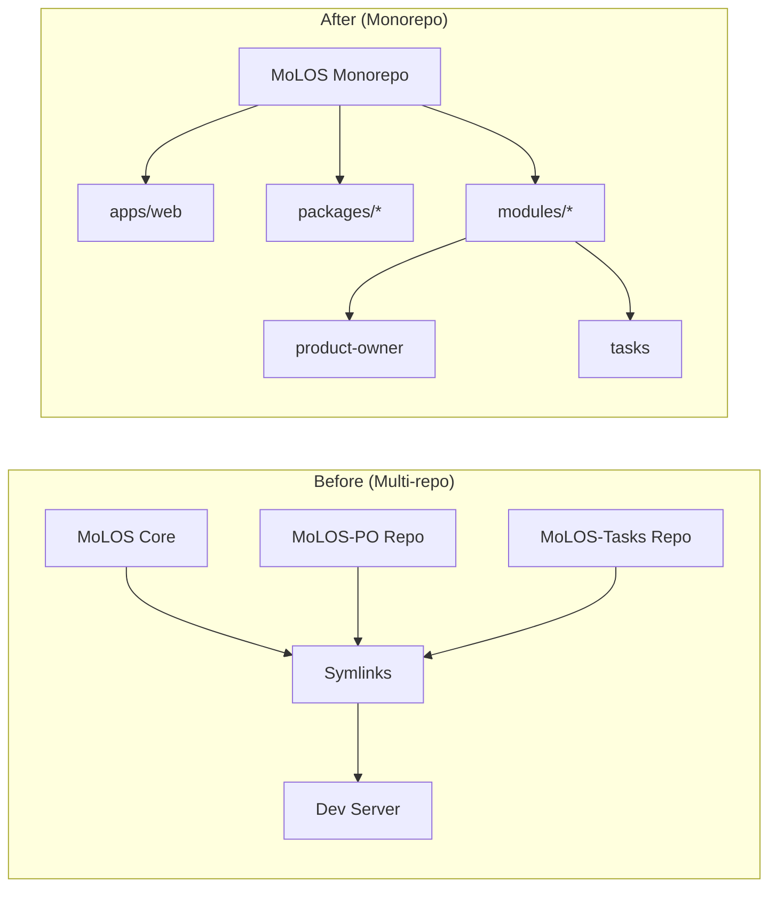

# MoLOS Monorepo Architecture

This document describes the technical architecture of the MoLOS monorepo, including directory structure, npm workspaces configuration, module loading mechanisms, and build system.

## Directory Structure

### Overview

```
MoLOS/
├── apps/                        # Deployable applications
│   └── web/                     # Main SvelteKit application
│       ├── src/
│       │   ├── routes/          # SvelteKit routes
│       │   ├── lib/             # App-specific libraries
│       │   └── hooks.server.ts  # Server hooks
│       ├── static/              # Static assets
│       ├── svelte.config.js
│       ├── vite.config.ts
│       └── package.json
│
├── packages/                    # Shared packages (published to npm)
│   ├── core/                    # Core utilities and types
│   │   ├── src/
│   │   │   ├── utils/
│   │   │   ├── types/
│   │   │   └── index.ts
│   │   └── package.json
│   │
│   ├── ui/                      # Shared UI components
│   │   ├── src/
│   │   │   ├── components/
│   │   │   └── index.ts
│   │   └── package.json
│   │
│   ├── database/                # Database schema and utilities
│   │   ├── src/
│   │   │   ├── schema/
│   │   │   ├── migrations/
│   │   │   └── index.ts
│   │   └── package.json
│   │
│   └── ai-tools/                # Shared AI tool definitions
│       ├── src/
│       │   ├── tools/
│       │   └── index.ts
│       └── package.json
│
├── modules/                     # MoLOS modules (internal packages)
│   ├── product-owner/           # Product Owner module
│   │   ├── src/
│   │   │   ├── routes/          # Module routes
│   │   │   ├── lib/             # Module libraries
│   │   │   │   ├── components/
│   │   │   │   ├── server/
│   │   │   │   │   ├── ai/      # AI tools
│   │   │   │   │   └── db/      # Database schema
│   │   │   │   └── index.ts
│   │   │   └── module.ts        # Module entry point
│   │   ├── manifest.yaml        # Module metadata
│   │   └── package.json
│   │
│   └── [other-modules]/
│
├── tools/                       # Build and development tools
│   ├── module-cli/              # Module development CLI
│   └── scripts/                 # Utility scripts
│
├── docs/                        # Documentation
├── drizzle/                     # Core database migrations
├── package.json                 # Root package.json (workspaces)
├── turbo.json                   # Turborepo configuration
└── pnpm-workspace.yaml          # pnpm workspace config (if using pnpm)
```

### Key Directories Explained

| Directory   | Purpose                 | Published?            |
| ----------- | ----------------------- | --------------------- |
| `apps/`     | Deployable applications | No                    |
| `packages/` | Reusable shared code    | Yes (optional)        |
| `modules/`  | MoLOS feature modules   | No (bundled with app) |
| `tools/`    | Development tooling     | No                    |

## npm Workspaces

### Configuration

The root `package.json` defines the workspace structure:

```json
{
	"name": "molos-monorepo",
	"private": true,
	"workspaces": ["apps/*", "packages/*", "modules/*"],
	"devDependencies": {
		"turbo": "^2.0.0"
	},
	"scripts": {
		"dev": "turbo run dev",
		"build": "turbo run build",
		"test": "turbo run test",
		"lint": "turbo run lint"
	}
}
```

### Workspace Package Structure

Each workspace package has its own `package.json`:

```json
// modules/product-owner/package.json
{
	"name": "@molos/module-product-owner",
	"version": "1.0.0",
	"private": true,
	"main": "./src/index.ts",
	"types": "./src/index.ts",
	"dependencies": {
		"@molos/core": "workspace:*",
		"@molos/database": "workspace:*"
	},
	"peerDependencies": {
		"svelte": "^5.0.0"
	}
}
```

### Dependency Resolution

```
npm install (at root)
    │
    ├─> Hoists common dependencies to root node_modules/
    │
    ├─> Creates symlinks in node_modules/@molos/* for workspace packages
    │
    └─> Each package can have its own dev dependencies
```

**Benefits:**

- Single `node_modules/` at root (with workspace symlinks)
- Deduplication of common dependencies
- Clear dependency boundaries between packages

## Module Loading Mechanism

### Dynamic Module Discovery

Modules are discovered at build time using SvelteKit's `import.meta.glob`:

```typescript
// apps/web/src/lib/server/modules/registry.ts

// Discover all module configs
const moduleConfigs = import.meta.glob('../../../modules/*/src/index.ts', { eager: true });

// Discover all module routes (for route table)
const moduleRoutes = import.meta.glob('../../../modules/*/src/routes/**/+page.svelte', {
	eager: false
});

// Discover AI tools from modules
const moduleAiTools = import.meta.glob('../../../modules/*/src/lib/server/ai/*.ts', {
	eager: false
});
```

### Module Registration

```typescript
// apps/web/src/lib/server/modules/loader.ts

interface DiscoveredModule {
	id: string;
	manifest: ModuleManifest;
	config: ModuleConfig;
	routes: RouteDefinition[];
	aiTools: AiToolDefinition[];
}

export async function discoverModules(): Promise<DiscoveredModule[]> {
	const modules: DiscoveredModule[] = [];

	for (const [path, moduleExports] of Object.entries(moduleConfigs)) {
		const moduleId = extractModuleId(path);
		const manifest = await loadManifest(moduleId);
		const config = (moduleExports as any).moduleConfig;

		modules.push({
			id: moduleId,
			manifest,
			config,
			routes: await discoverRoutes(moduleId),
			aiTools: await discoverAiTools(moduleId)
		});
	}

	return modules;
}
```

### Runtime Module Activation

Modules are activated based on database configuration:

```typescript
// apps/web/src/hooks.server.ts

import { discoverModules } from '$lib/server/modules/loader';
import { getActiveModuleIds } from '$lib/server/db/queries/modules';

export async function handle({ event, resolve }) {
	// Get active modules from database
	const activeModuleIds = await getActiveModuleIds();

	// Attach module context to event
	event.locals.modules = await getModuleContexts(activeModuleIds);

	return resolve(event);
}
```

## Build System Architecture

### Turborepo Configuration

```jsonc
// turbo.json
{
	"$schema": "https://turbo.build/schema.json",
	"pipeline": {
		"build": {
			"dependsOn": ["^build"],
			"outputs": [".svelte-kit/**", "dist/**"]
		},
		"dev": {
			"cache": false,
			"persistent": true
		},
		"test": {
			"dependsOn": ["build"],
			"outputs": []
		},
		"lint": {
			"outputs": []
		},
		"db:generate": {
			"outputs": ["drizzle/**"]
		},
		"db:migrate": {
			"cache": false
		}
	}
}
```

### Build Order

```
1. packages/core          (no dependencies)
2. packages/database      (depends on core)
3. packages/ui            (depends on core)
4. packages/ai-tools      (depends on core)
5. modules/*              (depends on packages/*)
6. apps/web               (depends on all above)
```

Turborepo automatically determines this order based on package dependencies.

### Development Workflow

```bash
# Start all packages in dev mode
npm run dev

# Start specific app
npm run dev --filter=@molos/web

# Build specific package and its dependencies
npm run build --filter=@molos/module-product-owner...

# Run tests for changed packages
npm run test --filter=[changed]
```

## Dependency Management

### Shared Dependencies

Dependencies used across multiple packages should be hoisted to the root:

```json
// Root package.json
{
	"devDependencies": {
		"svelte": "^5.45.0",
		"@sveltejs/kit": "^2.49.0",
		"typescript": "^5.9.0",
		"vitest": "^4.0.0"
	}
}
```

### Package-Specific Dependencies

Dependencies only used by one package stay in that package:

```json
// modules/product-owner/package.json
{
	"dependencies": {
		"marked": "^17.0.0", // Only used by this module
		"@molos/core": "workspace:*"
	}
}
```

### Peer Dependencies

Framework packages use peer dependencies:

```json
// packages/ui/package.json
{
	"peerDependencies": {
		"svelte": "^5.0.0",
		"@sveltejs/kit": "^2.0.0"
	}
}
```

## Comparison: Before vs After

### Directory Structure



### Import Paths

**Before (with symlinks):**

```typescript
// Symlinked from external_modules/MoLOS-Product-Owner/lib/...
import { moduleConfig } from '$lib/config/external_modules/MoLOS-Product-Owner';
import { ProjectCard } from '$lib/components/external_modules/MoLOS-Product-Owner';
```

**After (with packages):**

```typescript
// Direct import from workspace package
import { moduleConfig, ProjectCard } from '@molos/module-product-owner';
```

### Build Process

**Before:**

```bash
# Multiple steps, manual coordination
cd external_modules/MoLOS-Product-Owner && npm install && npm run build
cd ../..
npm run link-modules  # Creates symlinks
npm run build
```

**After:**

```bash
# Single command
npm run build  # Turborepo handles everything
```

## Module Isolation

### Namespace Isolation

Each module's database tables are namespaced:

```typescript
// modules/product-owner/src/lib/server/db/schema/tables.ts
import { getTableName } from '@molos/database';

const MODULE_ID = 'product-owner';

export const projects = sqliteTable(getTableName(MODULE_ID, 'projects'), {
	id: text('id').primaryKey(),
	name: text('name').notNull()
});
// Creates table: mod_product_owner_projects
```

### Event Isolation

Modules communicate only through the core event bus:

```
┌─────────────────┐
│ Module A        │
│ (Isolated)      │
└────────┬────────┘
         │ publish event
         ▼
┌─────────────────┐     notify      ┌─────────────────┐
│  Core Event Bus │ ──────────────▶ │ Module B        │
│                 │                 │ (Isolated)      │
└─────────────────┘                 └─────────────────┘
```

See [05-module-interaction.md](./05-module-interaction.md) for details.

## TypeScript Configuration

### Project References

```jsonc
// tsconfig.json (root)
{
	"references": [
		{ "path": "./packages/core" },
		{ "path": "./packages/database" },
		{ "path": "./packages/ui" },
		{ "path": "./modules/product-owner" },
		{ "path": "./apps/web" }
	],
	"compilerOptions": {
		"composite": true
	}
}
```

### Package tsconfig.json

```jsonc
// modules/product-owner/tsconfig.json
{
	"extends": "../../tsconfig.base.json",
	"compilerOptions": {
		"rootDir": "./src",
		"outDir": "./dist",
		"paths": {
			"@molos/core": ["../../packages/core/src"],
			"@molos/database": ["../../packages/database/src"]
		}
	},
	"include": ["src/**/*"],
	"exclude": ["node_modules", "dist"]
}
```

## Next Steps

- **Migration**: See [02-migration-guide.md](./02-migration-guide.md)
- **Module Development**: See [03-module-development.md](./03-module-development.md)
- **Module Interaction**: See [05-module-interaction.md](./05-module-interaction.md)

---

_Last Updated: 2025-02-15_
_Version: 1.0_
