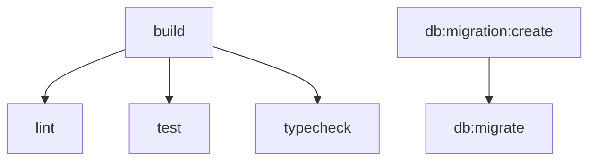

# Turborepo Integration

Turborepo manages builds, tests, and tasks across all packages and modules in parallel with caching.

## Structure

```
MoLOS/
├── packages/           # Shared packages
│   ├── core/           # @molos/core
│   ├── database/       # @molos/database
│   ├── module-types/   # @molos/module-types
│   └── ui/             # @molos/ui
│
├── modules/            # Modules
│   ├── ai/             # @molos/module-ai
│   └── MoLOS-Tasks/    # @molos/module-tasks
│
├── turbo.json          # Turborepo config
└── package.json        # Workspace definitions
```

## Commands

### Run Across All Packages

```bash
# Build all packages and app
bun run build

# Run tests across all packages
bun run test

# Run linting across all packages
bun run lint

# Type check everything
bun run typecheck

# Create new migration
bun run db:migration:create --name add_feature --module MoLOS-Tasks

# Run migrations in all modules
bun run db:migrate

# Clean all build artifacts
bun run clean
```

### Run on Specific Package

```bash
# Run task on specific package
turbo run build --filter=@molos/module-tasks

# Run on multiple packages
turbo run test --filter=@molos/database --filter=@molos/module-tasks

# Run on package and dependencies
turbo run build --filter=@molos/module-tasks...

# Run on package and dependents
turbo run build --filter=...@molos/database
```

## Task Pipeline



Tasks in `turbo.json`:

| Task                  | Description       | Cache           |
| --------------------- | ----------------- | --------------- |
| `build`               | Build packages    | ✅              |
| `lint`                | Lint code         | ✅              |
| `test`                | Run tests         | ✅              |
| `typecheck`           | Type check        | ✅              |
| `db:migration:create` | Create migrations | ❌              |
| `db:migrate`          | Run migrations    | ❌              |
| `dev`                 | Dev servers       | ❌ (persistent) |
| `clean`               | Clean artifacts   | ❌              |

## Caching

Turborepo caches build outputs. To bust cache:

```bash
# Force rebuild
turbo run build --force

# Or clear cache
rm -rf .turbo
```

## CI/CD Example

```yaml
# .github/workflows/ci.yml
name: CI

on: [push, pull_request]

jobs:
  build-and-test:
    runs-on: ubuntu-latest
    steps:
      - uses: actions/checkout@v4

      - uses: oven-sh/setup-bun@v1

      - name: Install
        run: bun install

      - name: Sync Modules
        run: bun run module:sync

      - name: Build
        run: bun run build

      - name: Test
        run: bun run test

      - name: Lint
        run: bun run lint

      - name: Type Check
        run: bun run typecheck
```

## Module Package Scripts

Each module should have these scripts for Turborepo:

```json
{
	"scripts": {
		"db:generate": "drizzle-kit generate",
		"db:migrate": "drizzle-kit migrate",
		"lint": "prettier --check .",
		"test": "vitest run",
		"typecheck": "tsc --noEmit"
	}
}
```
